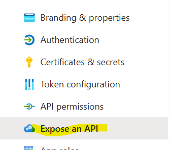
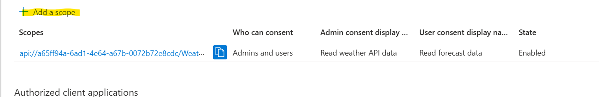
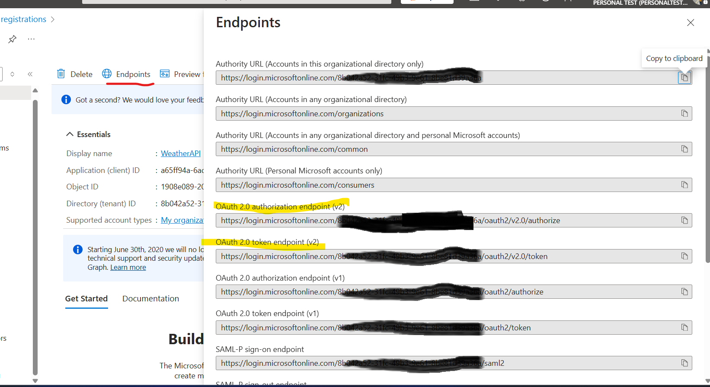
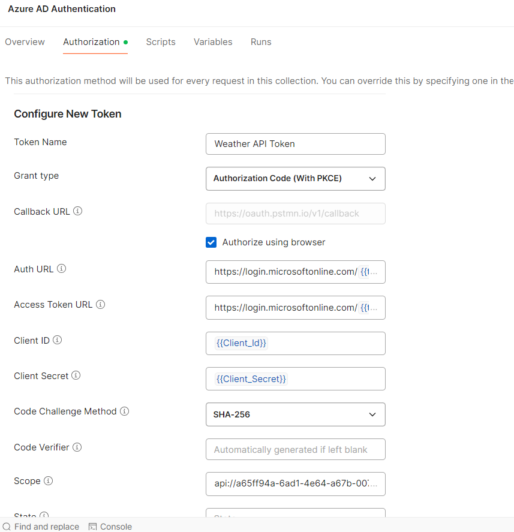

# Following steps are used to register your .Net Core API  using Azure AD and then authenticate it via Postman

- Navigate to portal.azure.com
- Search for feature termed as Microsoft EntraId
- Locate AppRegistration and click on it
  . 
- Click of new Registration
   . 
- Click on Register
  . 
- Once register is successful, click on Certificates & Secrets
  
- Click on  **Expose an API** and add scope
 
 
- Once these changes are done, you can go to **Overview** page and copy these
-  
- Open Postman , Go to Authorization Tab and select AuthType as **OAuth2.0**
- 